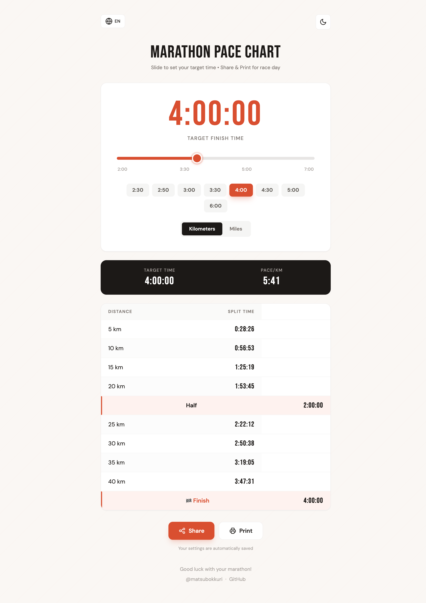
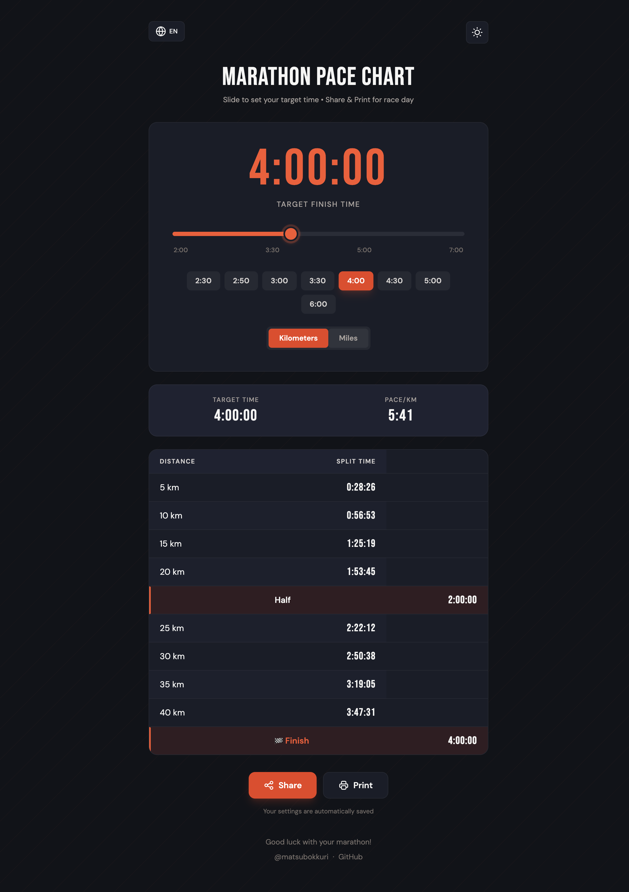

# Marathon Pace Chart

[](https://github.com/matsubo/marathon-pace/actions/workflows/test.yml)
[](https://github.com/matsubo/marathon-pace/actions/workflows/deploy.yml)
[](https://opensource.org/licenses/MIT)
[](https://reactjs.org/)
[](https://www.typescriptlang.org/)
[](https://vitejs.dev/)

A web application to calculate marathon split times. Set your target finish time and get pace charts for race day.

🏃 **[Live Demo](https://matsubo.github.io/marathon-pace/)**

| Light Mode | Dark Mode |
|:---:|:---:|
|  |  |

## Features

- **Slider-based input** - Easy time selection (2:00:00 - 7:00:00) without typing
- **Unit support** - Switch between kilometers and miles
- **Multi-language** - English, Japanese, Chinese, Spanish, Hindi (auto-detected from browser)
- **Dark mode** - Eye-friendly dark theme with localStorage persistence
- **Share image** - Generate and download a pace card as PNG via Canvas rendering
- **Social sharing** - Share on X (Twitter) and Facebook with OG meta tags
- **URL sharing** - Share specific target times via query param (e.g., `?target_time=3-30-00`)
- **Print-friendly** - Optimized layout for printing
- **Footer links** - Social media links and sponsor support (Buy Me a Coffee, GitHub Sponsors)

## Tech Stack

- React 19 + TypeScript
- Vite 5
- Tailwind CSS 3
- React Router 6
- Vitest + Testing Library
- Lucide React (icon library)

## Development

```bash
pnpm install              # Install dependencies
pnpm run dev              # Start dev server (localhost:5173)
pnpm run build            # TypeScript check + Vite production build
pnpm run preview          # Preview production build
pnpm run typecheck        # tsc --noEmit
pnpm run lint             # ESLint src/
pnpm run test             # Vitest single run
pnpm run test:watch       # Vitest watch mode
```

## Project Structure

```
src/
├── App.tsx                        # Main component (UI, state, pace calculation, share image)
├── main.tsx                       # Entry point with React Router
├── OgImage.tsx                    # OG image rendering route (/og-image)
├── index.css                      # Tailwind directives + custom styles
├── components/
│   ├── Icons.tsx                  # Lucide React icon exports
│   └── GoogleTagManager.tsx       # GTM analytics component
├── hooks/
│   ├── useLocalStorage.ts         # Generic localStorage hook + useLanguage
│   └── useLocalStorage.test.ts
├── utils/
│   ├── constants.ts               # Marathon distances, checkpoints, formatters
│   ├── constants.test.ts          # Comprehensive pace & split calculation tests
│   ├── translations.ts            # Type-safe i18n (5 languages)
│   └── translations.test.ts
└── test/
    └── setup.ts                   # Vitest setup (jsdom, jest-dom matchers)
```

## State Flow

URL query param (`?target_time=3-30-00`) takes precedence over localStorage, which takes precedence over the default (4:00:00). When the slider changes, both localStorage and the URL are updated. Language is detected from the browser on first visit, then persisted to localStorage.

## Design System

- **Fonts**: Bebas Neue (display) for times/headings, DM Sans (body text) via Google Fonts
- **Colors**: `track-*` (vermillion accent) and `surface-*` (background) palettes in `tailwind.config.js`
- **Dark mode**: CSS class-based (`dark` on `<html>`)

## Deployment

Auto-deploys to GitHub Pages via GitHub Actions on push to `main`.

The workflow handles:
- Automatic base path detection for project pages vs user/org pages
- Google Tag Manager injection (production only, via `VITE_GTM_ID` env var)
- Sitemap generation (excludes `/og-image` route)

### Setup

1. Push code to a GitHub repository
2. Go to **Settings > Pages**
3. Under "Build and deployment", select **GitHub Actions**

## License

MIT
